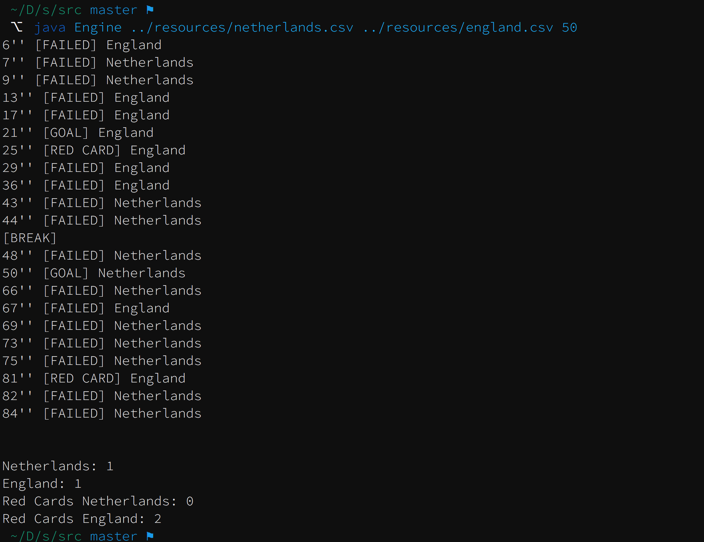

# soccer-simulation-engine

Football game engine simulator based on Online Soccer Manager.

Developed in java, this project has the objective to simulate a football (soccer) game between England and Netherlands. 

It takes account the overall value of the players roster, players age, the form of the teams, percentage of supporters present on the stadium between each teams and the team playing style. The referee it is also taken in account, with its personality value.

### Player variables

* **Overall value:** Highest values, higher chance of scoring or defending with success.
* **Age:** The older the roster, the more "weak" the players get with game time passing by, reducing the chance of scoring or defending. 

### Team variables definition

* **Team form:** `Integer between 0-100`, being `0` the lowest form possible and `100` the highest.
	* Highest values gives more chances of scoring goals and winning.
* **Percentage of supporters:** `Integer between 0-100`, where the sum of the two teams values, must be `100`. 
	* The team with most supporters has some advantage.
* **Playing Style:** `Integer between 0-100`, being `0`the most defensive possible, and `100` the most attacking.
	* A team with a high attacking playing style has more chance of attacking and scoring, but is more vulnerable on the defence side.
	
### Referee variables
* **Personality:** `Integer between 0-100`. The higher a personality value of a referee the stricter he is, and higher the chance of giving a red card to a team.
	* A team with sent off players is eavily penalised.


## Compiling

In order to compile you only need to do the following:

```
> cd src 
> javac *.java

```

## Running

In order to run you need to use a `csv` file with the infos of each team's players. In `resources` folder there is the corresponding files to test.

The `csv` has the following composition:

* First line

```
TeamName;Form;Suporters;PlayingStyle
```

* Following lines
 
```
PlayerName;Position;Attack;Defence;Status;Nationality;DateOfBirth;FullName
(...) 
```

Where:
* Position: 
    * ```G```: goal-keeper
    * ```D```: defender
    * ```M```: midfielder
    * ```A```: attacker
* Status:
    * ```T```: starting
    * ```S```: substitute
    * ```O```: out

**Running** 

Arguments List:

* **args[0]:** home team info csv
* **args[1]:** away team info csv
* **args[2]:** referee personality

```
> java Engine ../resources/netherlands.csv ../resources/england.csv 50
```

The output shows the main events of the game and at the end prints the final result and total of red cards for each team.



## Future work

* Substitutions
* More realistic simulation 
* Injuries
* Yellow cards and Red cards with accumulation